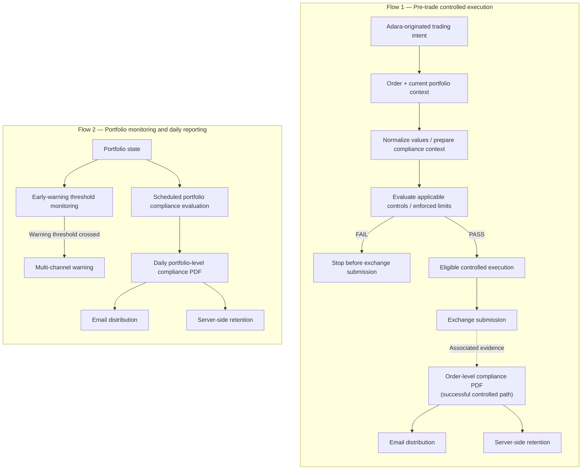

# Compliance Flow Diagram

This diagram presents two related but distinct compliance responsibilities: pre-trade enforcement for orders originated through Adara, and portfolio monitoring with scheduled daily reporting.

Pre-trade enforcement applies to discretionary and automated orders originated through Adara. A failed applicable control stops the controlled path before exchange submission; only the successful path reaches submission. The dotted evidence relationship associates the order-level PDF with the successfully controlled path without prescribing exact transactional sequencing.

Early-warning thresholds are separate from enforced limits. Crossing a warning threshold can trigger a multi-channel warning but is not presented as necessarily being a formal compliance-rule violation.

Order-level compliance evidence and the scheduled daily portfolio-level compliance PDF are distinct reporting views. Each has its own email-distribution and server-retention responsibility; the portfolio report is not represented as a sum of individual-order PDFs.

This is a public responsibility view, not a detailed rules engine, implementation sequence, or legal compliance model. It does not define thresholds, formulas, recipients, escalation procedures, or regulatory status.
