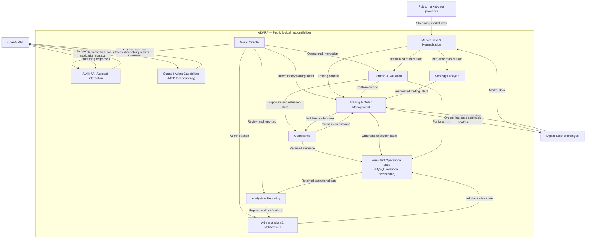

# Logical Architecture Diagram

This diagram presents Adara as interacting areas of logical responsibility. External market-data, exchange, and AI-service boundaries are shown only where they clarify the flow of market state, trading intent, execution information, retained evidence, and AI-assisted interaction.

The boxes in this diagram represent public logical responsibilities, not a one-to-one map of deployable components, processes, JARs, hosts, or AWS resources.

The diagram is not a deployment, network, or source-code/module view. Multiple responsibilities may cooperate within the platform, and the drawing intentionally omits implementation-sensitive topology, interfaces, and security configuration.

AiAlly is an AI-assisted user and operational interface, not algorithmic trading logic. The Responses API mediates remote MCP tool requests and receives results from the curated Adara capability boundary; the diagram does not depict AiAlly independently invoking a local MCP tool. The MCP node publishes no tool names, count, permissions, or configuration. The OpenAI boundary represents the Responses/MCP replacement successfully validated in pre-production; production rollout is pending. The Assistants API generation is a historical production implementation that is currently unavailable following retirement of the upstream API and is not shown as a current runtime path.
