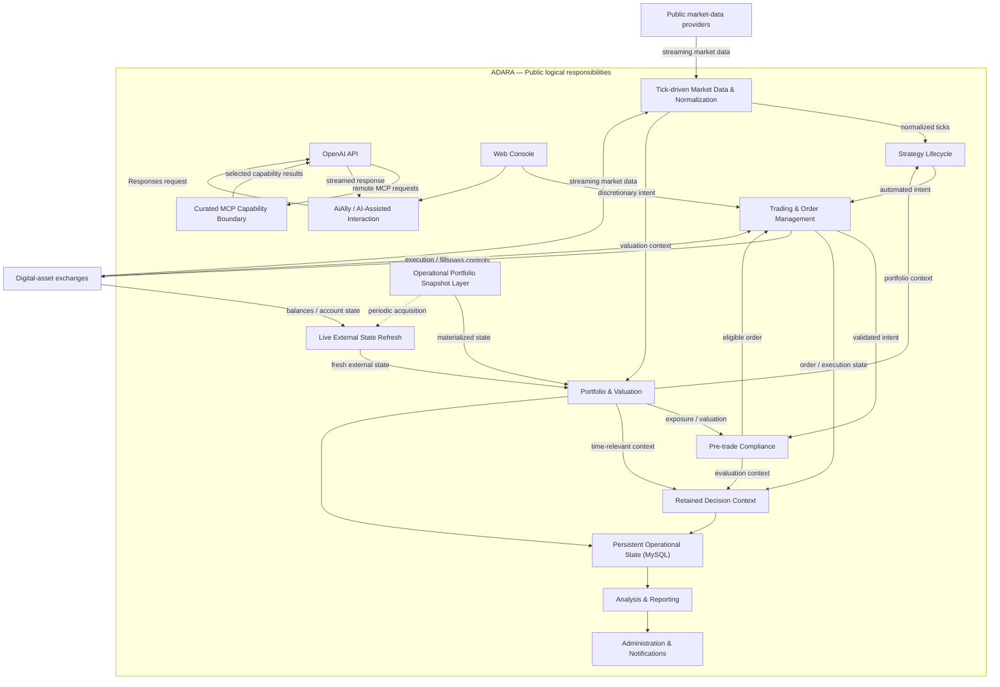

# Logical Architecture Diagram

The diagram emphasizes Adara's three architectural themes: tick-driven market ingestion, snapshot/live portfolio state, and retained decision provenance.

This is a responsibility view, not a deployment or module map. Multiple responsibilities may live within the same runtime component.

The snapshot and live-refresh paths are intentionally shown as separate concepts because freshness and external-dependency cost are architectural choices.

AiAlly is a later interface layer and does not own trading decisions or deterministic compliance controls.
