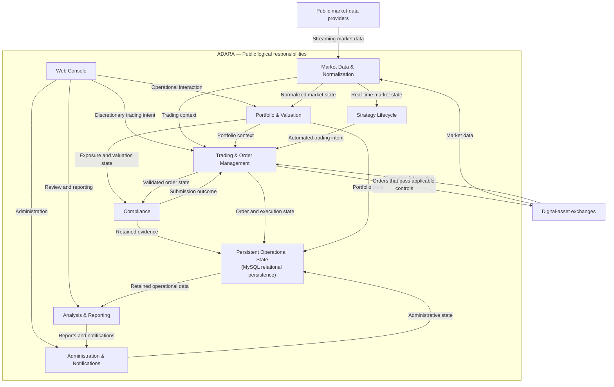

# Logical Architecture Diagram

This diagram presents Adara as interacting areas of logical responsibility. External market-data and exchange boundaries are shown only where they clarify the flow of market state, trading intent, execution information, and retained evidence.

The boxes in this diagram represent public logical responsibilities, not a one-to-one map of deployable components, processes, JARs, hosts, or AWS resources.

The diagram is not a deployment, network, or source-code/module view. Multiple responsibilities may cooperate within the platform, and the drawing intentionally omits implementation-sensitive topology, interfaces, and security configuration.
