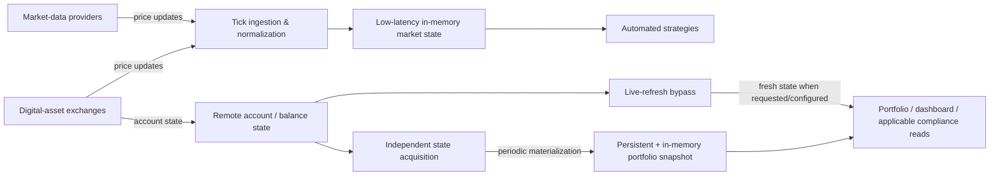

# Market State & Snapshot Path

This diagram shows two deliberately different data paths: tick-driven market processing and aggregate portfolio-state materialization.

The tick path exists to process changing market state as it arrives.

The snapshot path exists because repeatedly rebuilding aggregate portfolio state from many external accounts would unnecessarily couple dashboard and control reads to remote latency and availability.

The live-refresh path preserves an explicit way to prioritize freshness when required.
