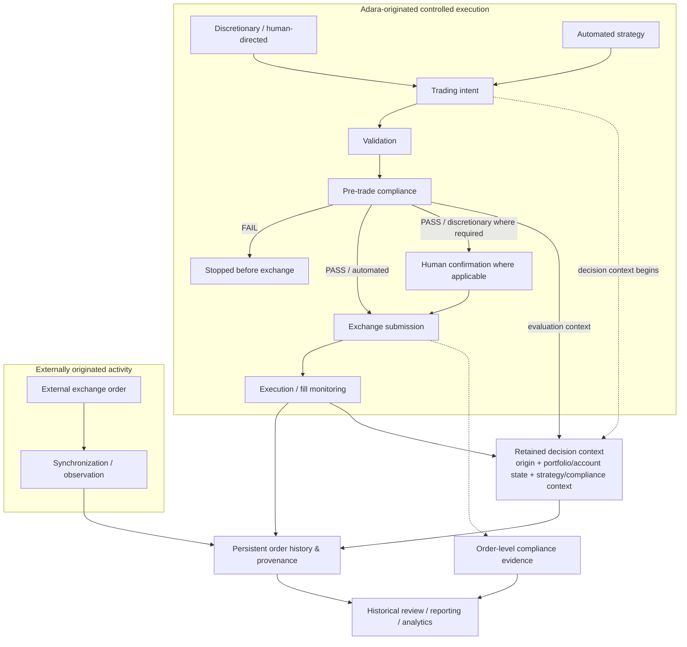

# Order Lifecycle Diagram

The diagram distinguishes controlled Adara-originated execution from externally originated activity.

The retained decision-context node is deliberately separate from the final order record: the architectural objective is to preserve enough historical state to explain why an order was allowed and, for automated activity, why the strategy acted.
