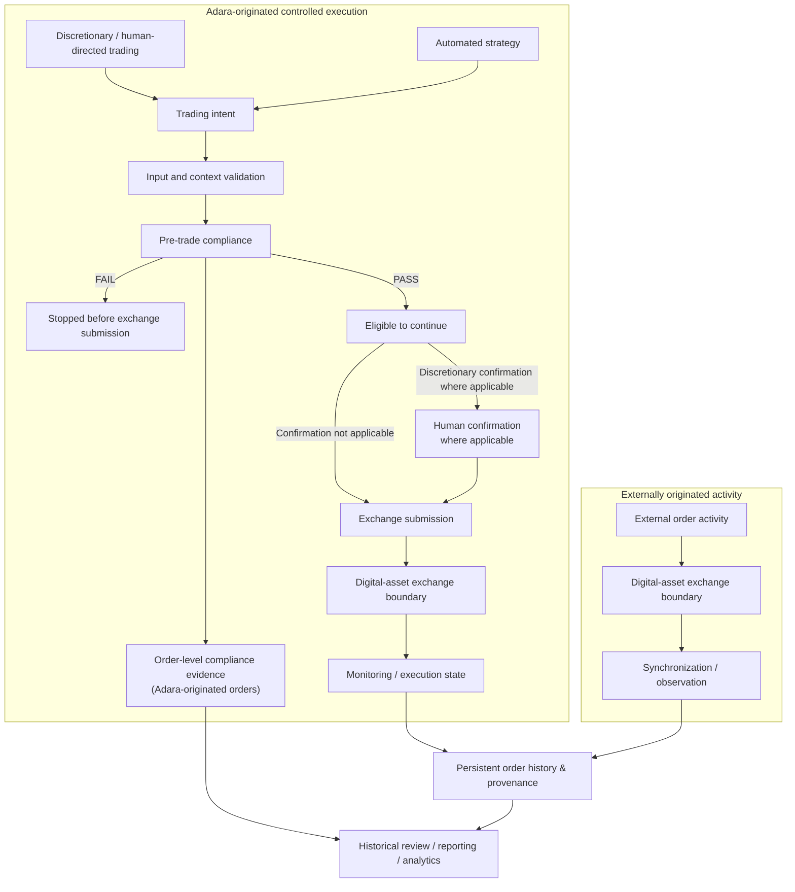

# Order Lifecycle Diagram

This diagram separates orders originated through Adara's controlled execution path from exchange activity that originated outside Adara and is later synchronized or observed.

The controlled pre-trade path applies to discretionary and automated orders originated through Adara. A failed applicable compliance result stops that path before exchange submission. Human confirmation is conditional and applies where required for discretionary activity; the diagram does not imply confirmation of each automated-strategy order.

Externally originated activity follows a separate observation path. It may be synchronized from an exchange and retained with provenance, but it is not represented as having passed through Adara's validation or pre-trade compliance controls before reaching the exchange.

This is a responsibility and lifecycle view, not an exact implementation state machine. The repeated exchange-boundary labels distinguish submitted and externally originated activity without identifying different venues or prescribing deployment components.
