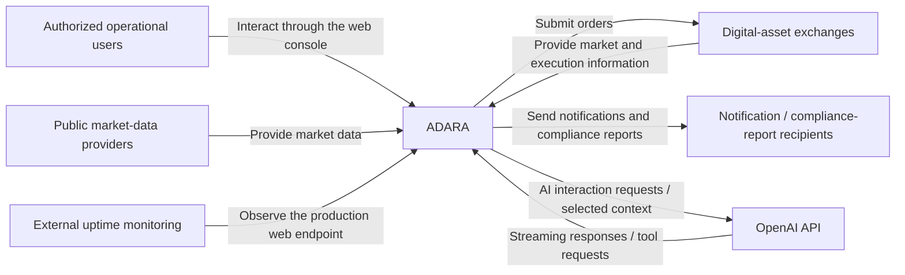

# System Context Diagram

This diagram places Adara within its public system context. Adara is represented as one system boundary; the surrounding nodes are external actors or systems that exchange information with it.

This is a system-context view, not a network or deployment topology. It does not identify organisations, exchanges, data providers, recipients, monitoring providers, infrastructure services, private endpoints, authorization, or communication protocols. The web console, AiAlly, and persistent operational state are inside the Adara system boundary and are therefore not shown as external systems.

The OpenAI API boundary represents AiAlly's external AI-service interaction. The first-generation Assistants API integration is a retired historical production implementation; the Responses API and remote MCP replacement has been validated in pre-production, with production rollout pending. The diagram does not imply that the replacement is currently operating in production.
